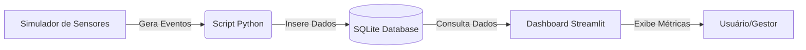

# Arquitetura da Solução - Sprint 2 (PoC)

## Visão Geral
Nesta Sprint 2, o objetivo é criar uma Prova de Conceito (PoC) funcional que demonstre o fluxo de dados completo: **Coleta (Sensores) -> Armazenamento (Banco de Dados) -> Análise (Dashboard)**.

A solução é composta por três módulos principais:

1.  **Simulador de Sensores (`src/sensors`)**: Script Python que gera dados sintéticos simulando interações físicas.
2.  **Gerenciador de Dados (`src/database`)**: Módulo responsável pela persistência dos dados em um banco SQLite local.
3.  **Dashboard de Análise (`src/dashboard`)**: Aplicação Web (Streamlit) para visualização de métricas em tempo real + insights supervisionados.
4.  **Camada Analítica (`src/analytics`)**: Limpeza de dados, engenharia de features e treinamento do modelo de classificação (toque curto x longo).

## Diagrama de Fluxo de Dados



## Detalhamento dos Componentes

### 1. Simulador de Sensores
-   **Função**: Simular o hardware do Totem.
-   **Dados Gerados**:
    -   `interaction_id`: Identificador único.
    -   `timestamp`: Data e hora do evento.
    -   `sensor_type`: Tipo de sensor (ex: 'touch', 'presence', 'voice').
    -   `value`: Valor da leitura (ex: coordenadas X/Y, duração, texto detectado).
-   **Tecnologia**: Python (bibliotecas padrão `random`, `time`).

### 2. Banco de Dados (SQLite)
-   **Função**: Armazenar histórico de interações.
-   **Schema Simplificado**:
    -   Tabela `interactions`: Armazena cada evento bruto.
-   **Tecnologia**: SQLite3 (nativo do Python).

### 3. Dashboard (Streamlit)
-   **Função**: Visualizar o que está acontecendo no Totem.
-   **Funcionalidades**:
    -   Gráfico de interações por hora.
    -   Distribuição de tipos de interação.
    -   Tabela de logs recentes.
    -   Seção “ML Insights” exibindo acurácia e última previsão do modelo.
-   **Tecnologia**: Streamlit, Pandas, Altair/Matplotlib.

### 4. Camada Analítica / ML
-   **Função**: Limpar e padronizar dados do SQLite e treinar um classificador supervisionado.
-   **Pipeline**:
    1. `analytics.data_utils` remove duplicatas, normaliza duração e extrai coordenadas de toque.
    2. `analytics.ml_training` treina um `LogisticRegression` (Scikit-Learn) e salva artefatos em `artifacts/`.
    3. O dashboard consome o dataset limpo para refrescar o insight “toque curto x longo”.

## Estrutura de Diretórios
```
/
├── docs/               # Documentação
├── src/
│   ├── database/       # Código do banco de dados
│   ├── sensors/        # Código da simulação
│   └── dashboard/      # Código do dashboard
├── data/               # Arquivo do banco de dados (totem.db)
└── README.md
```
